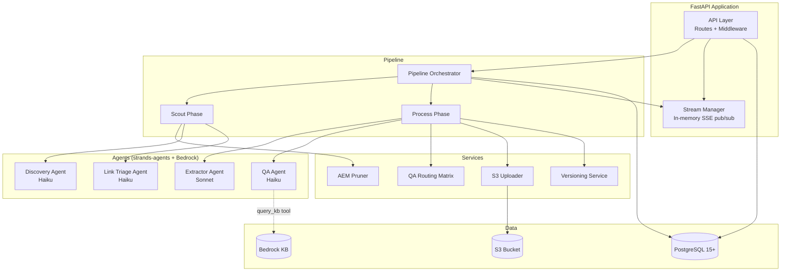

# Design Document — KB Manager v2 Backend

## Overview

KB Manager v2 Backend is a Python/FastAPI service that orchestrates AI-powered content ingestion from AEM websites and uploaded documents into a curated knowledge base. The system follows a two-phase pipeline architecture: a **scout phase** that discovers and classifies content, and a **process phase** that extracts, validates, and routes content through QA before storage in S3.

The backend exposes a RESTful API with SSE streaming for real-time progress, backed by PostgreSQL (async via asyncpg) and AI agents running on Amazon Bedrock (Claude Sonnet for extraction, Claude Haiku for discovery/triage/QA). Agent orchestration uses the `strands-agents` SDK.

### Key Design Decisions

1. **Async-first**: All I/O (database, HTTP, S3) uses async/await via asyncpg, httpx, and aiobotocore to maximize throughput under concurrent jobs.
2. **In-memory SSE pub/sub**: A `StreamManager` uses `asyncio.Queue` per subscriber rather than Redis, keeping the deployment simple for the initial single-instance target.
3. **Deterministic pruning before agents**: AEM JSON is cleaned by rule-based code before any LLM call, reducing token cost and improving agent accuracy.
4. **Computed counters**: File/job statistics are always computed via COUNT queries — no denormalized counters that can drift.
5. **Agent stubs with strands-agents**: Each agent is defined as a stub with typed input/output schemas, allowing the pipeline to be tested end-to-end with mocked agents.

---

## Architecture



### Project Structure

```
kb_manager/
├── main.py                    # FastAPI app factory, lifespan, CORS
├── config.py                  # Pydantic BaseSettings
├── database.py                # Engine, async session factory
├── models.py                  # SQLAlchemy ORM models (5 tables)
├── queries/
│   ├── sources.py             # Source CRUD + filtering
│   ├── jobs.py                # Job CRUD + status transitions
│   ├── files.py               # File CRUD + pagination + search
│   ├── links.py               # Content link CRUD
│   └── nav_cache.py           # Nav tree cache operations
├── routes/
│   ├── ingest.py              # POST /ingest, scout-stream, content-map, confirm, progress-stream
│   ├── files.py               # GET/PUT /files, approve, reject, revalidate
│   ├── sources.py             # GET /sources, active-jobs
│   ├── kb.py                  # POST /kb/search, /kb/chat, /kb/download
│   ├── nav.py                 # GET /nav/tree
│   └── stats.py               # GET /stats
├── services/
│   ├── stream_manager.py      # In-memory SSE event bus
│   ├── pipeline.py            # Two-phase orchestrator
│   ├── aem_pruner.py          # Deterministic AEM JSON pruning
│   ├── s3_uploader.py         # S3 upload with key construction
│   ├── versioning.py          # modify_date comparison + supersede
│   └── routing_matrix.py      # QA verdict → file status mapping
├── agents/
│   ├── discovery.py           # Discovery Agent stub
│   ├── link_triage.py         # Link Triage Agent stub
│   ├── extractor.py           # Extractor Agent stub
│   └── qa.py                  # QA Agent stub (with query_kb tool)
├── schemas/
│   ├── ingest.py              # Request/response models for ingestion
│   ├── files.py               # File list/detail models
│   ├── sources.py             # Source list/detail models
│   ├── kb.py                  # Search/chat models
│   └── common.py              # PaginatedResponse, shared models
├── alembic/
│   ├── alembic.ini
│   ├── env.py
│   └── versions/
│       └── 001_baseline.py    # Creates all 5 tables
├── Dockerfile
└── docker-compose.yml
```

---

## Components and Interfaces

### 1. Configuration (`config.py`)

```python
class Settings(BaseSettings):
    DATABASE_URL: str                          # Required, no default
    S3_BUCKET_NAME: str                        # Required, no default
    AWS_REGION: str = "us-east-1"
    BEDROCK_MODEL_ID: str = "us.anthropic.claude-sonnet-4-20250514-v1:0"
    HAIKU_MODEL_ID: str = "us.anthropic.claude-3-5-haiku-20241022-v1:0"
    BEDROCK_KB_ID: str | None = None           # None = uniqueness checks disabled
    BEDROCK_MAX_TOKENS: int = 16000
    AEM_REQUEST_TIMEOUT: int = 30
    MAX_CONCURRENT_JOBS: int = 3

    model_config = SettingsConfigDict(env_file=".env")
```

Singleton access via `get_settings()` with `@lru_cache`.

### 2. Database Layer (`database.py`)

- `create_async_engine` with the `DATABASE_URL` from settings
- `async_sessionmaker` bound to the engine
- `get_db()` async generator for FastAPI dependency injection
- Lifespan hook creates/disposes the engine

### 3. Stream Manager (`services/stream_manager.py`)

```python
class StreamManager:
    """In-memory SSE event bus. One channel per job_id."""

    async def subscribe(self, job_id: str, channel: str) -> AsyncGenerator[dict, None]:
        """Yields events for a job/channel. Blocks until events arrive or job ends."""

    async def publish(self, job_id: str, channel: str, event: str, data: dict) -> None:
        """Publishes an event to all active subscribers of a job/channel."""

    async def close_channel(self, job_id: str, channel: str) -> None:
        """Signals end-of-stream and cleans up resources."""
```

- Channels: `"scout"` and `"progress"` per job
- Each subscriber gets its own `asyncio.Queue`
- A sentinel `None` value signals stream end
- Keepalive is handled at the route level (15s timer interleaved with queue reads)

### 4. AEM Pruner (`services/aem_pruner.py`)

```python
def prune_aem_json(raw: dict) -> dict:
    """Applies deterministic pruning rules to AEM model.json.
    
    1. Drop top-level keys: i18n, dataLayer
    2. Drop items keyed with 'experiencefragment' prefix
    3. Drop items whose :type matches noise patterns
    4. Clean up :itemsOrder arrays
    5. Recursively process nested :items
    Returns a new dict (does not mutate input).
    """

def is_denied_url(url: str) -> bool:
    """Returns True if URL matches the denylist patterns."""
```

Pure functions, no side effects. Idempotent by design.

### 5. Pipeline Orchestrator (`services/pipeline.py`)

```python
class Pipeline:
    async def run_scout(self, job_id: UUID, source_url: str, steering_prompt: str | None) -> None:
        """Phase 1: Fetch → Prune → Discover → Classify links → Store results."""

    async def run_process(self, job_id: UUID, confirmation: ConfirmRequest) -> None:
        """Phase 2: Extract → QA → Route → Upload approved → Complete."""

    async def run_upload_process(self, job_id: UUID, files: list[UploadFile]) -> None:
        """Upload flow: Parse → QA → Route → Upload approved → Complete."""
```

- Uses `asyncio.Semaphore(MAX_CONCURRENT_JOBS)` to limit concurrency
- Publishes events to `StreamManager` at each step
- Wraps each phase in try/except to set `failed` status on unrecoverable errors

### 6. Agent Stubs (`agents/`)

Each agent is a class wrapping `strands-agents` with typed I/O:

```python
# agents/discovery.py
class DiscoveryAgent:
    async def run(self, pruned_json: dict) -> DiscoveryResult:
        """Returns components: list[Component], links: list[RawLink]"""

# agents/link_triage.py
class LinkTriageAgent:
    async def run(self, source_context: str, linked_structure: dict) -> TriageResult:
        """Returns classification, reason, has_sub_links, sub_link_count"""

# agents/extractor.py
class ExtractorAgent:
    async def run(self, components: list[dict], steering_prompt: str | None,
                  expansion_content: dict | None = None) -> list[ExtractedFile]:
        """Returns markdown files with YAML frontmatter"""

# agents/qa.py
class QAAgent:
    async def run(self, md_content: str) -> QAResult:
        """Returns quality_verdict, quality_reasoning, uniqueness_verdict,
        uniqueness_reasoning, similar_file_ids"""
    # Tool: query_kb(content_snippet, limit=3) → list[SimilarDoc]
```

### 7. QA Routing Matrix (`services/routing_matrix.py`)

```python
def route_file(quality: str, uniqueness: str, metadata_complete: bool) -> str:
    """Returns target status: 'approved' | 'pending_review' | 'rejected'"""
```

Pure function implementing the 3×3 verdict matrix plus metadata gate.

### 8. S3 Uploader (`services/s3_uploader.py`)

```python
class S3Uploader:
    async def upload(self, file: KBFile) -> str | None:
        """Uploads markdown to S3. Returns s3_key on success, None on failure."""

    async def delete(self, s3_key: str) -> bool:
        """Deletes a file from S3. Used when superseding versions."""

    async def generate_presigned_url(self, s3_uri: str) -> str:
        """Returns a presigned download URL for the given S3 URI."""

    def build_s3_key(self, kb_target: str, brand: str, region: str,
                     namespace: str, filename: str) -> str:
        """Constructs: {kb_target}/{brand}/{region}/{namespace}/{filename}"""
```

### 9. Versioning Service (`services/versioning.py`)

```python
class VersioningService:
    async def check_and_supersede(self, source_url: str, new_modify_date: datetime,
                                  db: AsyncSession) -> str:
        """Returns 'process' | 'skip'. If 'process', marks old file as superseded."""
```

### 10. API Routes

All routes mounted under `/api/v1`. Each route module uses FastAPI's `APIRouter`.

| Route | Method | Handler Summary |
|-------|--------|-----------------|
| `/health` | GET | Returns `{"status": "ok"}` |
| `/ingest` | POST | Creates source + job, triggers scout/upload |
| `/ingest/{job_id}/scout-stream` | GET | SSE stream of scout events |
| `/ingest/{job_id}/content-map` | GET | Returns scout results (recovery) |
| `/ingest/{job_id}/confirm` | POST | Applies overrides, triggers process phase |
| `/ingest/{job_id}/progress-stream` | GET | SSE stream of process events |
| `/files` | GET | Paginated file list with filters |
| `/files/{file_id}` | GET | Full file detail with hydrated similar_files |
| `/files/{file_id}/approve` | POST | Approve + trigger S3 upload |
| `/files/{file_id}/reject` | POST | Reject with notes |
| `/files/{file_id}` | PUT | Edit content + trigger QA re-run |
| `/files/{file_id}/revalidate` | POST | Synchronous QA re-run |
| `/sources` | GET | Paginated source list |
| `/sources/{source_id}` | GET | Source detail with file stats |
| `/sources/active-jobs` | GET | Active job mapping |
| `/kb/search` | POST | SSE search results |
| `/kb/chat` | POST | SSE RAG chat |
| `/kb/download` | POST | Presigned S3 URL |
| `/nav/tree` | GET | AEM nav tree (cached) |
| `/stats` | GET | Dashboard aggregates |

---

## Data Models

### Pydantic Schemas (Request/Response)

#### Ingestion Schemas (`schemas/ingest.py`)

```python
class AemUrlInput(BaseModel):
    url: str
    region: str
    brand: str
    nav_label: str | None = None
    nav_section: str | None = None
    page_path: str | None = None

class IngestRequest(BaseModel):
    connector_type: Literal["aem", "upload"]
    urls: list[AemUrlInput] | None = None
    kb_target: Literal["public", "internal"]
    steering_prompt: str | None = None

class JobCreated(BaseModel):
    job_id: UUID
    source_url: str
    status: str

class IngestResponse(BaseModel):
    jobs: list[JobCreated]

class LinkOverride(BaseModel):
    link_id: UUID
    classification: Literal["expansion", "sibling", "dismissed"]

class ConfirmRequest(BaseModel):
    link_overrides: list[LinkOverride] | None = None
    excluded_component_ids: list[str] | None = None
    steering_prompt: str | None = None
```

#### File Schemas (`schemas/files.py`)

```python
class FileSummary(BaseModel):
    id: UUID
    title: str
    status: str
    region: str | None
    brand: str | None
    kb_target: str
    quality_verdict: str | None
    uniqueness_verdict: str | None
    source_url: str | None
    created_at: datetime

class SimilarFile(BaseModel):
    id: UUID
    title: str
    source_url: str | None

class FileDetail(FileSummary):
    md_content: str
    modify_date: datetime | None
    merged_from_urls: list[str] | None
    quality_reasoning: str | None
    uniqueness_reasoning: str | None
    similar_files: list[SimilarFile]
    s3_key: str | None
    reviewed_by: str | None
    review_notes: str | None
    job_id: UUID
    source_id: UUID

class ApproveRequest(BaseModel):
    reviewed_by: str
    notes: str | None = None

class RejectRequest(BaseModel):
    reviewed_by: str
    notes: str

class EditRequest(BaseModel):
    md_content: str
    reviewed_by: str
```

#### Common Schemas (`schemas/common.py`)

```python
class PaginatedResponse(BaseModel, Generic[T]):
    items: list[T]
    total: int
    page: int
    size: int
    pages: int
```

### SQLAlchemy ORM Models (`models.py`)

Five models mapping directly to the schema in shared-contracts.md §1:

- `Source` — `sources` table (UUID PK, type, identifier, region, brand, kb_target, metadata JSONB, created_at)
- `IngestionJob` — `ingestion_jobs` table (UUID PK, source_id FK, status, steering_prompt, scout_summary JSONB, error_message, started_at, completed_at)
- `ContentLink` — `content_links` table (UUID PK, job_id FK, target_url, anchor_text, classification, classification_reason, status, has_sub_links, sub_link_count, created_at)
- `KBFile` — `kb_files` table (UUID PK, job_id FK, source_id FK, title, md_content, source_url, region, brand, kb_target, modify_date, merged_from_urls, status, quality/uniqueness verdicts + reasoning, similar_file_ids, s3_key, reviewed_by, review_notes, created_at)
- `NavTreeCache` — `nav_tree_cache` table (UUID PK, root_url UNIQUE, brand, region, tree_data JSONB, fetched_at, expires_at)

All use `mapped_column` with `server_default=func.now()` for timestamp defaults and `server_default=func.gen_random_uuid()` for UUID PKs.


---

## Correctness Properties

*A property is a characteristic or behavior that should hold true across all valid executions of a system — essentially, a formal statement about what the system should do. Properties serve as the bridge between human-readable specifications and machine-verifiable correctness guarantees.*

### Property 1: Required settings validation

*For any* combination of environment variables where `DATABASE_URL` or `S3_BUCKET_NAME` is absent, constructing `Settings` should raise a validation error that names the missing variable.

**Validates: Requirements 1.2, 1.5**

### Property 2: Unique constraint enforcement on sources

*For any* two source records with the same `(type, identifier)` pair, inserting the second record should raise an integrity error.

**Validates: Requirements 2.3**

### Property 3: Unique constraint enforcement on content_links

*For any* two content_link records with the same `(job_id, target_url)` pair, inserting the second record should raise an integrity error.

**Validates: Requirements 2.4**

### Property 4: Unique constraint enforcement on nav_tree_cache

*For any* two nav_tree_cache records with the same `root_url`, inserting the second record should raise an integrity error.

**Validates: Requirements 2.5**

### Property 5: API route prefix

*For any* route registered in the FastAPI application (excluding `/health`), the route path should start with `/api/v1`.

**Validates: Requirements 3.3**

### Property 6: CRUD round trip

*For any* valid record for any of the five tables, creating it and then reading it back by ID should return an equivalent record.

**Validates: Requirements 4.1**

### Property 7: Pagination correctness

*For any* dataset of N items and any valid `(page, size)` pair where `size > 0`, the paginated response should return at most `size` items, `total` should equal N, and `pages` should equal `ceil(N / size)`.

**Validates: Requirements 4.2, 10.1**

### Property 8: Filter correctness

*For any* dataset and any filter parameter (status, region, brand, kb_target, type), all items in the filtered response should match the filter value.

**Validates: Requirements 4.3, 11.1**

### Property 9: Case-insensitive title search

*For any* search string `s` and any set of files, all files returned by the search query should have a title that contains `s` when compared case-insensitively, and no file whose title contains `s` (case-insensitive) should be excluded.

**Validates: Requirements 4.4**

### Property 10: AEM ingest creates correct number of jobs

*For any* valid AEM ingest request containing N URLs, the response should contain exactly N jobs, each with status `"scouting"` and a distinct `job_id`.

**Validates: Requirements 5.1**

### Property 11: Ingest request schema validation

*For any* `IngestRequest` where `connector_type` is `"aem"` and `urls` is empty or None, the request should be rejected with a validation error. *For any* valid request matching the shared-contracts schema, it should be accepted.

**Validates: Requirements 5.3**

### Property 12: SSE event serialization

*For any* SSE event type (scouting_started, component_found, link_found, link_classified, scout_complete, extraction_started, page_processing, file_created, qa_started, qa_complete, job_complete, error) and any valid event data, serializing the event should produce a string matching the `event: {type}\ndata: {json}\n\n` format with all required fields present.

**Validates: Requirements 6.2, 9.2**

### Property 13: Confirmation overrides are applied

*For any* set of link_overrides and excluded_component_ids in a confirm request, after confirmation: (a) each overridden content_link record should reflect the new classification/status, and (b) each excluded component should be marked `included: false` in the scout_summary JSONB.

**Validates: Requirements 8.2, 8.3**

### Property 14: File detail hydrates similar_files

*For any* kb_file with `similar_file_ids` containing valid UUIDs, the file detail response should include a `similar_files` array where each entry has `id`, `title`, and `source_url` matching the referenced files.

**Validates: Requirements 10.2**

### Property 15: File review actions update status and reviewer

*For any* file and any review action (approve with `reviewed_by` or reject with `reviewed_by` and `notes`), after the action: the file status should be `"approved"` or `"rejected"` respectively, `reviewed_by` should match the input, and for rejection `review_notes` should match the input.

**Validates: Requirements 10.3, 10.4**

### Property 16: File edit updates content

*For any* file and any new `md_content` string, after a PUT edit, the file's `md_content` should equal the new content.

**Validates: Requirements 10.5**

### Property 17: Source detail file stats are accurate

*For any* source with associated kb_files, the source detail response should report `total`, `approved`, `pending`, and `rejected` counts that exactly match the actual counts of files with those statuses in the database.

**Validates: Requirements 11.2**

### Property 18: Active jobs returns only active statuses

*For any* set of ingestion_jobs, the active-jobs endpoint should return only jobs whose status is in `("scouting", "awaiting_confirmation", "processing")`, and should include all such jobs.

**Validates: Requirements 11.3**

### Property 19: AEM pruner removes all noise

*For any* valid AEM JSON, after pruning: (a) the keys `i18n` and `dataLayer` should be absent at the top level, (b) no item key should start with `experiencefragment`, (c) no item should have a `:type` ending with any of the noise patterns (headerNavigation, footerNavigation, footerLegal, header, footer, loginModal, bookingwidget, multiColumnLinks), and (d) every entry in any `:itemsOrder` array should correspond to an existing key in the sibling `:items` object.

**Validates: Requirements 12.1, 12.2, 12.3, 12.4**

### Property 20: AEM pruner URL denylist

*For any* URL string, `is_denied_url` should return `True` if and only if the URL path contains one of the denylist segments: `/reservation`, `/login`, `/account`, `/search`, `/booking`, `/checkout`, `/payment`, `/registration`, `/reset-password`.

**Validates: Requirements 12.5**

### Property 21: AEM pruner idempotence

*For any* valid AEM JSON input, `prune(prune(x))` should produce a result identical to `prune(x)`.

**Validates: Requirements 12.6**

### Property 22: Stream manager channel isolation and fan-out

*For any* two distinct job_ids and any number of subscribers per channel, events published to one job's channel should be delivered to all and only subscribers of that channel, and should not appear in the other job's channel.

**Validates: Requirements 13.1, 13.2**

### Property 23: Stream manager late subscriber sees only new events

*For any* sequence of events published to a channel, a subscriber that connects after some events have been published should receive only events published after the subscription point.

**Validates: Requirements 13.3**

### Property 24: Stream manager cleanup

*For any* job channel, after `close_channel` is called, the internal data structures should no longer hold references to that job_id's channel.

**Validates: Requirements 13.4**

### Property 25: Pipeline failure sets job to failed

*For any* exception raised during scout or process phase execution, the pipeline should set the job status to `"failed"`, store the exception message in `error_message`, and publish an error SSE event.

**Validates: Requirements 14.5**

### Property 26: QA routing matrix correctness

*For any* `(quality_verdict, uniqueness_verdict)` pair drawn from `{good, acceptable, poor} × {unique, overlapping, duplicate}`, `route_file` should return the status defined by the routing matrix: good+unique→approved, good+overlapping→pending_review, good+duplicate→rejected, acceptable+unique→pending_review, acceptable+overlapping→pending_review, acceptable+duplicate→rejected, poor+any→rejected.

**Validates: Requirements 16.1, 16.2, 16.3, 16.4, 16.5, 16.6, 16.7**

### Property 27: Metadata gate rejects incomplete files

*For any* file missing one or more of the required metadata fields (`title`, `content_type`, `source_url`, `region`, `brand`), the routing should return `"rejected"` regardless of quality and uniqueness verdicts.

**Validates: Requirements 16.8**

### Property 28: S3 key construction

*For any* valid `(kb_target, brand, region, namespace, filename)` tuple, `build_s3_key` should return a string matching the pattern `{kb_target}/{brand}/{region}/{namespace}/{filename}` with no leading or trailing slashes and no double slashes.

**Validates: Requirements 17.1**

### Property 29: Versioning decision

*For any* existing file with `modify_date` M and any new `modify_date` N: if N > M, the versioning service should return `"process"` and mark the old file as `"superseded"`; if N == M, it should return `"skip"` and leave the old file unchanged.

**Validates: Requirements 18.1, 18.2, 18.3**

### Property 30: Nav tree cache TTL

*For any* freshly fetched navigation tree stored in the cache, `expires_at` should equal `fetched_at + 24 hours`.

**Validates: Requirements 20.4**

### Property 31: Nav tree cache hit

*For any* cached tree whose `expires_at` is in the future, a request for that `root_url` (without `force_refresh`) should return the cached `tree_data` without fetching.

**Validates: Requirements 20.2**

### Property 32: Dashboard stats accuracy

*For any* set of kb_files and ingestion_jobs in the database, the `/stats` response should report counts that exactly match: `total_files` = count of all files, `pending_review` = count where status is `pending_review`, `approved` = count where status is `approved`, `rejected` = count where status is `rejected`, `active_jobs` = count of jobs with active statuses, `sources_count` = count of sources, `kb_public_files` = count where kb_target is `public`, `kb_internal_files` = count where kb_target is `internal`.

**Validates: Requirements 21.1**

---

## Error Handling

### HTTP Error Responses

All error responses use a consistent JSON shape:

```json
{ "detail": "Human-readable error message" }
```

| Scenario | Status Code | Detail |
|----------|-------------|--------|
| Resource not found (job, file, source) | 404 | `"{resource_type} {id} not found"` |
| Content map requested while scouting | 409 | `"Scouting is still in progress"` |
| Confirm on non-awaiting job | 409 | `"Job is not awaiting confirmation"` |
| Invalid request body | 422 | Pydantic validation errors (auto) |
| Missing required env var at startup | Exit | Pydantic `ValidationError` on `Settings()` |
| S3 upload failure | Logged | File stays `approved`, `s3_key` remains null |
| Agent invocation failure | 500 / SSE error | Error event published, job set to `failed` |
| AEM fetch timeout | SSE error | Error event published, job set to `failed` |
| Database connection failure | 500 | `"Database unavailable"` |

### Pipeline Error Strategy

- Each pipeline phase (scout, process) is wrapped in a top-level try/except
- On unrecoverable error: job status → `"failed"`, `error_message` populated, error SSE event published
- Individual file failures during process phase do not fail the entire job — the file is marked `rejected` with error reasoning, and processing continues for remaining files
- Agent timeouts use the configured `AEM_REQUEST_TIMEOUT` and `BEDROCK_MAX_TOKENS` limits

### SSE Error Recovery

- If SSE connection drops, the client can call `GET /ingest/{job_id}/content-map` to recover scout state
- Progress stream events are fire-and-forget — if the client reconnects, it polls the job/file status via REST endpoints
- Keepalive comments (`:keepalive\n\n`) every 15 seconds prevent proxy/load-balancer timeouts

---

## Testing Strategy

### Testing Framework

- **Unit/integration tests**: `pytest` + `pytest-asyncio`
- **Property-based tests**: `hypothesis` (Python's standard PBT library)
- **HTTP testing**: `httpx.AsyncClient` with FastAPI's `TestClient`
- **Database testing**: `testcontainers` for PostgreSQL or SQLite async for unit tests
- **Mocking**: `unittest.mock` / `pytest-mock` for agent stubs and S3

### Property-Based Testing Configuration

- Library: **Hypothesis** (`hypothesis` Python package)
- Minimum iterations: **100 per property** (`@settings(max_examples=100)`)
- Each property test MUST be tagged with a comment referencing the design property:
  ```python
  # Feature: kb-manager-backend, Property 26: QA routing matrix correctness
  ```
- Each correctness property is implemented by a SINGLE property-based test
- Custom strategies will be defined for generating:
  - Valid AEM JSON structures (nested `:items` / `:itemsOrder` with various `:type` values)
  - Valid `(quality_verdict, uniqueness_verdict)` pairs
  - Valid file records, source records, job records
  - Random URL strings for denylist testing
  - Random pagination parameters `(page, size, total)`

### Dual Testing Approach

**Unit tests** cover:
- Specific examples: health endpoint returns 200, default config values are correct
- Edge cases: empty AEM JSON, S3 upload failure, missing metadata fields
- Integration points: pipeline scout flow with mocked agents, confirm flow with overrides
- Error conditions: 404 on missing resources, 409 on wrong job status

**Property tests** cover:
- Universal properties across all inputs (Properties 1–32 above)
- Comprehensive input coverage through Hypothesis strategies
- Invariants: pruner idempotence, routing matrix completeness, pagination math, filter correctness

Both are complementary — unit tests catch concrete bugs in specific scenarios, property tests verify general correctness across the input space.

### Key Test Modules

| Module | Focus |
|--------|-------|
| `tests/test_config.py` | Settings validation (Properties 1) |
| `tests/test_models.py` | Unique constraints, CRUD round trips (Properties 2–4, 6) |
| `tests/test_aem_pruner.py` | Pruning rules, denylist, idempotence (Properties 19–21) |
| `tests/test_routing_matrix.py` | Verdict→status mapping, metadata gate (Properties 26–27) |
| `tests/test_stream_manager.py` | Channel isolation, fan-out, late sub, cleanup (Properties 22–24) |
| `tests/test_s3_uploader.py` | Key construction (Property 28) |
| `tests/test_versioning.py` | Modify date comparison (Property 29) |
| `tests/test_pagination.py` | Pagination math, filtering, search (Properties 7–9) |
| `tests/test_queries.py` | Query layer CRUD + filters (Properties 6, 8, 9) |
| `tests/test_routes_ingest.py` | Ingest API: create jobs, schema validation (Properties 10–11) |
| `tests/test_routes_files.py` | Files API: detail hydration, approve/reject, edit (Properties 14–16) |
| `tests/test_routes_sources.py` | Sources API: stats accuracy, active jobs (Properties 17–18) |
| `tests/test_routes_stats.py` | Dashboard stats (Property 32) |
| `tests/test_nav_cache.py` | Cache TTL, cache hit (Properties 30–31) |
| `tests/test_pipeline.py` | Pipeline failure handling, SSE events (Property 25) |
| `tests/test_sse_events.py` | SSE event serialization (Property 12) |
| `tests/test_confirm.py` | Confirmation overrides (Property 13) |
| `tests/test_routes_prefix.py` | Route prefix check (Property 5) |
