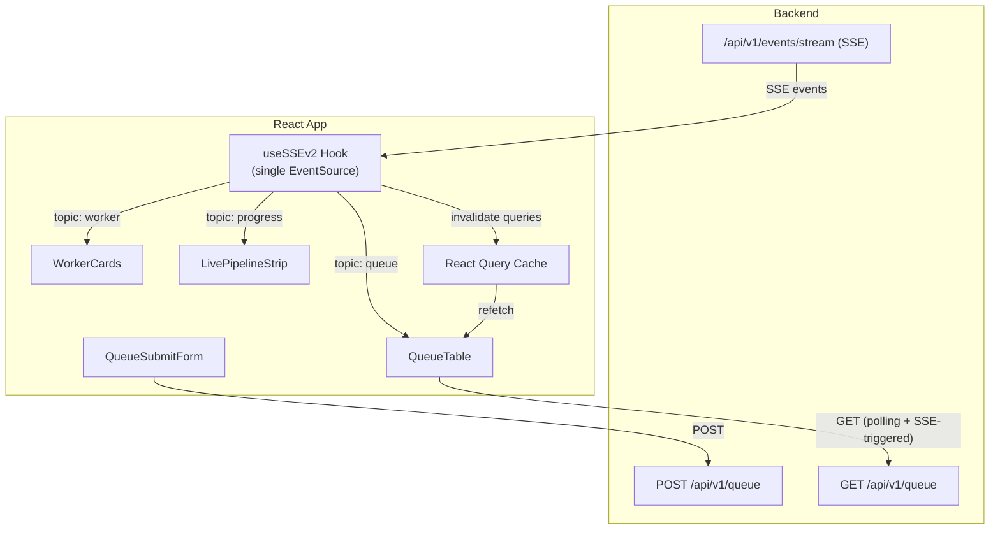

# Design Document: Queue System v2 Integration

## Overview

This design covers the frontend integration of Backend Queue System v2 into the ABG Knowledge System. The work spans five areas:

1. **SSE layer rewrite** — Replace the flat `/logs/stream` EventSource with a topic-based `/events/stream` hook that parses `{timestamp, topic, event, data}` envelopes and exposes per-topic subscriptions.
2. **Queue management UI** — A submission form with priority support and deduplication feedback, plus a queue items table showing retry progress, priority, and terminal vs. transient failure states.
3. **Worker status cards** — N real-time cards (currently 3) driven by `worker` and `progress` topic events, each showing active/idle state, current URL, pipeline phase, and a client-side elapsed timer.
4. **Live pipeline strip upgrade** — Migrate `LivePipelineStrip` from raw log events to structured `progress` topic events with topic badges and human-readable summaries.
5. **Type safety and API layer** — New TypeScript types for all v2 shapes and dedicated endpoint functions for queue operations.

The design preserves the existing page structure (KPI row → content grid → pipeline strip) while inserting worker cards and queue management into the visual hierarchy. All new components consume the single shared SSE connection through topic-filtered subscriptions.

## Architecture

### High-Level Data Flow



### Key Architectural Decisions

1. **Single EventSource, topic-filtered subscriptions.** One `useSSEv2` hook instance opens the connection. Consumers register topic filters (e.g. `"worker"`, `"progress"`) and only receive matching events. This avoids multiple SSE connections and centralizes reconnection logic.

2. **Hook rewrite, not wrapper.** The existing `useSSE` hook hard-codes named event listeners and a flat event model. The v2 envelope is fundamentally different (all events arrive as `message` type with topic/event inside the JSON). A new `useSSEv2` hook replaces the old one rather than wrapping it.

3. **Worker state managed in a reducer.** Worker cards need to track per-worker state (active/idle, URL, phase, start timestamp) across multiple event types. A `useReducer` inside a `useWorkerStatus` hook provides predictable state transitions driven by SSE events.

4. **Queue table uses React Query with SSE-triggered invalidation.** The queue items table fetches via `GET /queue` with 15-second polling. When a `queue` topic event arrives via SSE, it triggers an immediate React Query invalidation (throttled to 2s) for a faster refresh without maintaining a parallel client-side queue state.

5. **Existing components preserved.** The Uncertain Links panel, KPI cards, and Source Drawer remain unchanged. The Discovery Jobs table is replaced by the Queue Items table since queue items supersede the old source-based job view.

## Components and Interfaces

### New Hook: `useSSEv2`

**File:** `src/hooks/useSSEv2.ts`

```typescript
interface SSEv2Event {
  timestamp: number;
  topic: string;
  event: string;
  data: Record<string, unknown>;
  _clientId: string;   // client-generated unique ID
  _receivedAt: number; // client-side receipt timestamp
}

interface UseSSEv2Options {
  enabled?: boolean;
  topics?: string[];           // filter to these topics; empty = all
  bufferSize?: number;         // ring buffer capacity (default 50)
  onEvent?: (ev: SSEv2Event) => void;
}

function useSSEv2(options?: UseSSEv2Options): {
  events: SSEv2Event[];
  status: "idle" | "open" | "error" | "closed";
}
```

- Connects to `/api/v1/events/stream` via `EventSource`.
- Parses every `message` event as JSON into `SSEv2Event`.
- Filters by `topics` before pushing to the ring buffer.
- Silently drops events with unrecognized topics (forward-compatible).
- Exposes `status` reflecting connection state; relies on native `EventSource` reconnection on error.

### New Hook: `useWorkerStatus`

**File:** `src/hooks/useWorkerStatus.ts`

```typescript
interface WorkerState {
  workerId: number;
  status: "idle" | "active";
  url: string | null;
  phase: string | null;
  startedAt: number | null; // epoch ms from worker_started timestamp
}

function useWorkerStatus(workerCount?: number): WorkerState[]
```

- Internally calls `useSSEv2({ topics: ["worker", "progress"] })`.
- Maintains a `useReducer` with actions: `WORKER_STARTED`, `PHASE_CHANGED`, `WORKER_IDLE`.
- Maps `worker_started` → set active with URL and initial phase.
- Maps `phase_changed` → update phase for the matching worker.
- Maps `worker_idle` → reset to idle state.
- Returns an array of `workerCount` (default 3) worker states.

### New Component: `WorkerCards`

**File:** `src/components/discovery/WorkerCards.tsx`

```typescript
function WorkerCards(): JSX.Element
```

- Renders a horizontal row of `WorkerCard` components, one per worker from `useWorkerStatus()`.
- Each card shows: heading ("Worker 0"), status indicator (green pulsing dot for active, gray for idle), URL (truncated), phase label, and elapsed timer.
- Elapsed timer is computed client-side using `requestAnimationFrame` or a 1-second `setInterval` from `startedAt`.
- Uses existing `Card`, `CardHeader`, `CardBody` components.

### New Component: `QueueSubmitForm`

**File:** `src/components/discovery/QueueSubmitForm.tsx`

```typescript
function QueueSubmitForm(): JSX.Element
```

- Collapsible section with a textarea for URLs (one per line), a numeric priority input (default 0), and a submit button.
- On submit: calls `submitToQueue` endpoint, shows success toast with queued/skipped counts, or error toast on failure.
- Uses `useMutation` from React Query; invalidates `["queue"]` query key on success.

### New Component: `QueueTable`

**File:** `src/components/discovery/QueueTable.tsx`

```typescript
function QueueTable(): JSX.Element
```

- Fetches from `getQueueItems` via `useQuery` with `refetchInterval: 15_000`.
- Subscribes to `useSSEv2({ topics: ["queue"] })` and triggers `queryClient.invalidateQueries(["queue"])` on any queue event (throttled to 2s).
- Columns: URL, Status (with computed "exhausted"/"requeued" logic), Retries badge ("retry N/M"), Priority badge, Error, Last Updated.
- Uses existing `DataTable`, `Table`, `Badge`, `Pagination` components.

### Updated Component: `LivePipelineStrip`

**File:** `src/components/discovery/LivePipelineStrip.tsx` (modified)

- Switches from `useSSE("/logs/stream")` to `useSSEv2({ topics: ["progress"] })`.
- Displays topic badge next to each event entry.
- Renders error events with error-tone styling.
- Retains throttled React Query invalidation for `sources` and `stats` queries.

### Updated Page: `DiscoveryTools`

**File:** `src/pages/DiscoveryTools.tsx` (modified)

Layout order (top to bottom):
1. `PageHeader`
2. KPI cards row (unchanged)
3. `WorkerCards` row (new)
4. Main grid: `QueueSubmitForm` + `QueueTable` (2 cols) | Uncertain Links panel (1 col)
5. `LivePipelineStrip` (full width, bottom)

### API Endpoint Functions

**File:** `src/api/endpoints.ts` (additions)

```typescript
export const submitToQueue = (body: QueueSubmitRequest) =>
  apiClient.post<QueueSubmitResponse>("/queue", body).then(r => r.data);

export const getQueueItems = (params?: { page?: number; size?: number }) =>
  apiClient.get<Paginated<QueueItem>>("/queue", { params }).then(r => r.data);
```

## Data Models

### SSE Envelope (v2)

```typescript
/** Structured event envelope from /api/v1/events/stream */
interface SSEEnvelope {
  timestamp: number;
  topic: string;    // "worker" | "queue" | "progress"
  event: string;    // e.g. "worker_started", "item_completed", "phase_changed"
  data: Record<string, unknown>;
}
```

### Queue Item

```typescript
interface QueueItem {
  id: string;
  url: string;
  status: string;          // "queued" | "processing" | "completed" | "failed"
  retry_count: number;
  max_retries: number;
  priority: number;
  error_message: string | null;
  created_at: string;
  updated_at: string;
}
```

### Queue Submit Request / Response

```typescript
interface QueueSubmitRequest {
  urls: string[];
  priority: number;
}

interface QueueSubmitResponse {
  queued: number;
  skipped: number;
  item_ids: string[];
}
```

### Worker Event Names (Union Types)

```typescript
type WorkerEventName = "worker_started" | "worker_idle";

type ProgressEventName =
  | "phase_changed"
  | "scouting_started"
  | "component_found"
  | "link_found"
  | "link_classified"
  | "scout_complete"
  | "extraction_started"
  | "file_created"
  | "qa_complete"
  | "job_complete"
  | "error";
```

### Worker State (Client-Side)

```typescript
interface WorkerState {
  workerId: number;
  status: "idle" | "active";
  url: string | null;
  phase: string | null;
  startedAt: number | null;
}
```

### Computed Display Status for Queue Items

The queue table derives display status from the raw `QueueItem` fields:

| `status` | `retry_count` vs `max_retries` | Display Label | Badge Tone |
|-----------|-------------------------------|---------------|------------|
| `"failed"` | `retry_count === max_retries` | "exhausted" | `err` |
| `"failed"` | `retry_count < max_retries` | "requeued" | `warn` |
| `"queued"` | any | "queued" | `neutral` |
| `"processing"` | any | "processing" | `info` |
| `"completed"` | any | "completed" | `ok` |

